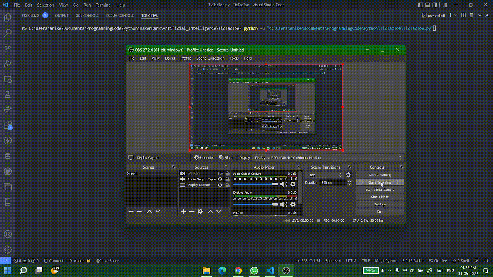

## **TI**c **T**ac **T**oe **AI** (**TITTAI**)
 

## __MOTIVATION__
---
During the course of Data Structures and Algorithms (DSA), my professor was once discussing the min-max algorithm in the context of game-theory problems like tic-tac-toe. I found it to be quite interesting and tried to solve a similar problem on [HackerRank](https://www.hackerrank.com/challenges/tic-tac-toe), but my score was exiguous. Henceforth, I wanted to ameliorate my solution.

## __PROBLEM STATEMENT__
---
The goal is to make the computer unbeatable, i.e, draw in the worst case. The solution involves using min-max algorithm, dynamic programming and then reducing the space complexity using number theory magic.

## __SOLUTION DETAILS__
---
The solution based on three main ideas:
1. **Min-max/Minimax Algorithm:** The min-max algorithm uses a game tree, which represents all possible board states in a tic-tac-toe game. <!--insert a tic tac toe game tree here!--> 
 Every node of that tree represents a state of the &game with a score. The score represents the likelihood of winning for the computer player. The idea is to make the move which maximizes the score on the next move available to the computer, and then taking into consideration the minimum possible score on the opponent's (human) move. This allows us to consider the best move possible for the opponent, hence giving the opponent an opportunity to play optimally. This way we end up maximizing the worst possible score of computer. In short the idea is to first take maximum for root node in the tree and then minimum for next level (children of the root), then again maximum for next level and so on till the game is over, i.e., either there is a winner or it's a draw. <!--Insert min-max gif with alternating max-min !-->

>|  |
>|:---:|
>| <b> _*Tic Tac Toe Game Tree*_</b>|
>|  |
>| <b> _*Min-Max Tree*_</b>|

2. **Dynamic Programing:** As we are well aware of the fact that most of the algorithms that form trees are recursive, and we also know that recursive function often tends to do similar calculations repeatedly (like the fibonacci). Therefore, dynamic programming (DP) comes to the rescue by saving the calculated results (in this case board state with player) in an lookup table or dictionary. As we have saved the calculated scores of various board states, so we can just refer to the lookup table in the future rather than calculate the same score on the same board again. This will happen since same board state can be reached even by making different moves. Hence, memoization makes the algorithm much faster.

3. **Encoding-Decoding of player with board state:** DP can only reduce the time complexity of the problem, however, in our case the state (the board) itself is bulky (3 \* 3 matrix) making the DP lookup table big. So in order to reduce the space complexity, I had to avoid multiple copies of the board and storing the board state in a compressed form. Henceforth, maths comes to the rescue as every number is distinct in the number system, I was able to encode the board state along with the player information to a ternary number and decode it back. So 39 \* 2 = 19k \* 2 (approx.) numbers could represent every possible board state and player combination reducing the space complexity significantly.  <!--Explain more about encoding here and why it is unique. show example!-->
Lets discuss the encoding and decoding for _**player 'O'**_ and _**board state**_ 
&nbsp;&nbsp;&nbsp;&nbsp;&nbsp;&nbsp;X _ X  
&nbsp;&nbsp;&nbsp;&nbsp;&nbsp;&nbsp;O _ _  
&nbsp;&nbsp;&nbsp;&nbsp;&nbsp;&nbsp;X O _  
_**Encoding :**_ 
I have consider 'X' : 1, 'O' : 2 and '_' : 0. We can represent the **board** as **(101200120)3** and, now I'll convert this in terms of ternary number. 
number = 1 \* 30 + 0 \* 31 + 1 \* 32 + 2 \* 33 + 0 \* 34 + 0 \* 35 + 1 \* 36 + 2 \* 37 + 0 \* 38 = 5167 
Since, I have to also encode the player with board, one more bit is required, i.e., (**_2_** 101200120)3 (2 as 'O' is the player).  
Therefore, number = 5167 + 2 \* 39 = 44533  
_**Decoding :**_
For decoding I'll take the number % 3 for the bit value, then divide the number by 3 to get quotient and repeated the this process 9 times. In the end I'll again take number % 3 to get the player info. 
number = 44533  
44533 % 3 = **1** , [44533 / 3] = 14844  
14844 % 3 = **0** , [14844 / 3] = 4948  
4948 % 3 = **1** , [4948 / 3] = 1649  
1649 % 3 = **2** , [1649 / 3] = 549  
549 % 3 = **0** , [549 / 3] = 183  
183 % 3 = **0** , [183 / 3] = 61  
61 % 3 = **1** , [61 / 3] = 20  
20 % 3 = **2** , [20 / 3] = 6  
6 % 3 = **0** , [6 / 3] = 2  
2 % 3 = **2**  
**Board : (101200120)3** and **Player : 'O'**  

## __RESULTS__
---
 

|  |
|:---:|
| <b> _*Player Vs Computer*_</b>|
|  |
| <b> _*Player Vs Player*_</b>|
|  |
| <b> _*Computer Vs Computer*_</b>|

## __PRE REQUISITE__
---
Python 3.9.12 or above

## __LICENSE__
---
+ This repository has no open-source license.
+ You can't modify or redistribute the code without explicit permission. However, you are allowed to run the code for private/educational use only.
+ According to terms and conditions of GitHub, in absence of any open source license, every user has the right to view and fork any public repository only.
